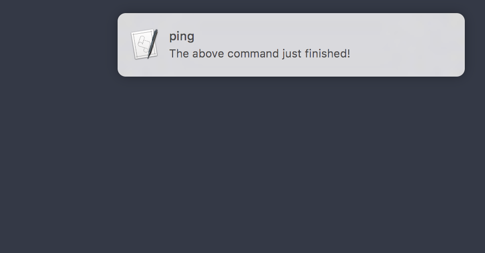

# ZSH Notification for macOS

If you want to have a beautiful notification that appears when a super-long-command (more than 10 seconds) you executed just returned, you can use that snippet. It will look something like this:




Just add this to your .zshrc and have ruby installed.

```bash
precmd()
{
    if [ $TIMESTAMP ]; then
        res=$(($SECONDS-$TIMESTAMP))
        if [ $res -ge 10 ]; then
            cmd=$(fc -ln -1)
            cmd=$(ruby -e "puts '$cmd'.split(\" \").first")
            notification $cmd "The above command just finished!"
        fi
    fi
}

preexec()
{
    export TIMESTAMP=$SECONDS
}

notification(){
    cmd="osascript -e 'display notification \"$2\" with title \"$1\" sound name \"Sosumi\"'"
    eval $cmd
}
```
